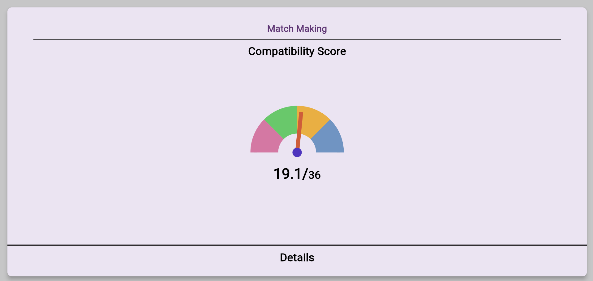

# Indicator

This Flutter project demonstrates a compatibility score indicator implemented using the Syncfusion Flutter Gauges library.

## Screenshots

<p align="center">
  
</p>

## Getting Started

Follow these steps to run this Flutter app on your local machine.

### Prerequisites

- Flutter SDK installed on your machine
- Android Studio or VS Code with Flutter extension

### Running the App

1. Clone this repository to your local machine:

   ```bash
   git clone https://github.com/your/repository.git
2. Open Terminal write
   ```bash
   flutter run
3. Choose any web browser e.g. Chrome,Edge etc
